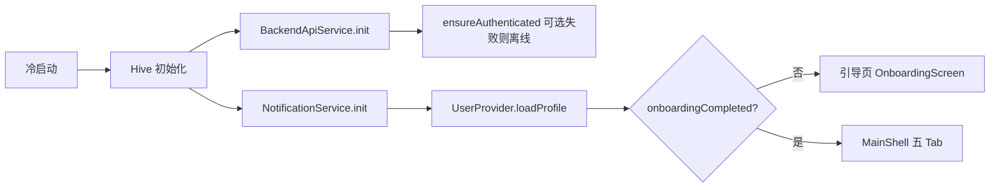

# 渴了么（KeLeME）产品说明文档

> 基于仓库当前实现整理，供产品评审、设计与研发对齐。版本信息见应用内展示（`pubspec.yaml` 与 `AppVersion`）。

---

## 1. 产品概述

### 1.1 一句话价值

用 **AI 辅助饮水计划与对话**，结合 **本地记录与可选云端同步**，帮助用户养成规律饮水习惯，并通过提醒与社区关怀强化坚持。

### 1.2 目标用户

关注健康、希望量化每日饮水、需要温和提醒与简单社交激励的用户（含希望提醒亲友「多喝水」的场景）。

### 1.3 核心场景

| 场景 | 说明 |
| --- | --- |
| 每日打卡 | 首页记录饮水、查看进度与连续天数 |
| 智能安排 | 结合天气与活动描述，由 AI 生成当日分段饮水计划 |
| AI 对话 | 咨询饮水与健康相关问题，支持工具调用（记笔记、设提醒、记饮水等） |
| 社区关怀 | 通过好友短码添加联系人，向对方发送关怀提醒；浏览广场类内容 |
| 个人设置 | 调整目标、提醒时段与风格、可选自填 DeepSeek API Key；查看 AI 记住的健康信息 |

### 1.4 非目标（当前实现不强调或不做）

- **完整医疗诊断或处方**：AI 输出为建议性质，非医疗结论。
- **账号体系与多端登录**：客户端以设备匿名登录（`BackendApiService`）为主；邮箱绑定等以后端能力为准，**待产品确认**是否在前端完整暴露。
- **纯云端优先**：本地 `SharedPreferences` + Hive 仍可离线使用核心记录；后端不可用时进入降级路径。

---

## 2. 信息架构

### 2.1 启动流程（冷启动 → 加载 → 首屏）

1. **初始化**：Hive 打开记忆、会话摘要、自定义提醒、今日计划等 Box；系统 UI 样式设置。
2. **服务**：本地通知初始化；后端 Dio 与 Token；尝试设备登录。
3. **资料**：加载用户档案与当日饮水、月度与连续天数等；异步拉天气与动态目标；异步同步饮水记录。
4. **首屏**：未完成引导 → 引导页；已完成 → **MainShell**（底部五 Tab）。

### 2.2 主导航（MainShell）

| Tab | 标签 | 职责概要 |
| --- | --- | --- |
| 0 | 首页 | 今日饮水进度、快捷打卡、天气与动态目标、日程与日历、连续天数 |
| 1 | 安排 | 今日 AI 饮水计划：输入活动/备注、生成流式结果、时间轴与操作 |
| 2 | AI 助手 | 与「AI 健康助手」对话，清空历史、建议快捷语 |
| 3 | 社区 | 关怀联系人、发送提醒、挑战/广场相关展示 |
| 4 | 设置 | API Key、基本参数、提醒、健康档案入口、测试通知、版本与隐藏调试入口 |

### 2.3 导航地图（路由与子页）

| 类型 | 名称 | 进入方式 |
| --- | --- | --- |
| 命名路由 | `/onboarding` | `MaterialApp.routes`（与首屏引导为同一页面类） |
| 命名路由 | `/debug` | 首页 Logo 连点 5 次；设置页版本区域连点 5 次 |
| 堆栈子页 | 个人设置 | **仅**作为 MainShell 第 5 个 Tab 嵌入；顶栏有返回样式，**无**单独 `Navigator` 入栈（见 8 节） |
| 堆栈子页 | AI 健康档案 | 设置 →「查看健康档案」`MaterialPageRoute` |
| 堆栈子页 | 添加关怀的人 | 社区 → 添加联系人 `MaterialPageRoute` |

**待产品确认**

1. **完成引导后的跳转**：`OnboardingScreen` 使用 `pushReplacementNamed('/home')`，但 `MaterialApp.routes` **未注册** `/home`，可能导致首次完成引导时路由异常。预期行为应为进入 `MainShell`（与 `home` 为同一主界面）。
2. **对话内「设置」**：`chat_bubble` 中存在 `Navigator.pushNamed(context, '/settings')`，但 **未注册** `/settings` 路由，该入口可能无法打开设置。**待产品确认**是否改为 Tab 切换或其它导航方式。

---

## 3. Flutter 页面分章

以下按「用户可见界面」描述；技术路径见第 7 节附录。

### 3.1 一级页面 · 首页（Home）

| 项目 | 内容 |
| --- | --- |
| **入口** | MainShell Tab「首页」 |
| **用户目标** | 快速查看今日饮水进度、补录饮水、了解天气与目标建议、查看记录与坚持天数 |
| **功能清单** | 问候与日期；环形进度与「还差 xml」「目标 xml」；**喝水打卡**打开底部 sheet，选择预设杯量并记录；今日打卡次数、连续天数、已喝总量；**天气 & AI 建议**（无定位/天气时展示占位）；**今日饮水时间线**（列表）；**月度打卡日历**；底部应用版本号；**Logo 连点 5 次**进入调试页（彩蛋） |
| **关键交互与状态** | 打卡后 SnackBar 反馈；达标时进度区庆祝动画；天气未就绪时卡片为「无天气」态；跨天由 `UserProvider` 归档昨日数据 |
| **数据与持久化** | `UserProvider`：`SharedPreferences`（档案、今日 ml、今日 logs、月度 hits、历史 streak）；天气与动态目标异步更新；饮水上报后端（可排队重试） |
| **出向跳转** | `Navigator.pushNamed('/debug')`（彩蛋） |

---

### 3.2 一级页面 · 安排（Plan）

| 项目 | 内容 |
| --- | --- |
| **入口** | MainShell Tab「安排」 |
| **用户目标** | 根据今日活动与起床时间等，生成 **AI 饮水时间表**，并可接受/调整片段 |
| **功能清单** | 顶部标题与日期；**基础目标卡片**（与档案联动）；**输入区**：活动类型、备注、可选覆盖起床时间；**生成**按钮；生成中 **流式文案**；成功后 **摘要、操作行、时间轴**（各时段建议饮水量）；解析失败/天气错误等错误 UI；重新生成 |
| **关键交互与状态** | `PlanStatus`：加载本地计划、加载天气、生成中、已有计划、解析错误、天气错误等；流式中间态展示 |
| **数据与持久化** | `PlanProvider` + Hive `today_plans`；天气 `WeatherService`/`LocationService`；AI 通过 `AiService`（直连或后端代理）；`UserProvider` 读档案 |
| **出向跳转** | 时间轴/操作内 `Navigator.pop` 关闭底部弹层（若有） |

---

### 3.3 一级页面 · AI 助手（Chat）

| 项目 | 内容 |
| --- | --- |
| **入口** | MainShell Tab「AI 助手」 |
| **用户目标** | 与 AI 对话获取饮水与健康建议；通过工具自动记笔记、设提醒、记饮水 |
| **功能清单** | 顶栏：返回（见注）、标题「AI 健康助手」、**清空对话**（确认对话框）；消息列表（用户/助手可见文本）；生成中 **typing**；空对话时 **建议 chips**；输入框与发送；工具成功时 **SnackBar**（如已记住、已设提醒、已记录 ml） |
| **关键交互与状态** | 初始化未完成时全屏 Loading；生成中禁用输入；离开前可触发会话摘要（`ChatProvider`） |
| **数据与持久化** | `ChatProvider` + `AiService` + `AiConfig`（含 Key、是否后端代理）；`UserProvider` 上下文；Hive 中与记忆/摘要相关数据由会话逻辑写入（与「健康档案」展示同源） |
| **出向跳转** | 气泡内若点击「设置」使用 `pushNamed('/settings')` — **当前路由未注册，待修复或产品确认** |

**注**：该 Tab 在 `IndexedStack` 内，顶栏「返回」在纯 Tab 场景下行为依赖 `Navigator` 栈，**待产品确认**是否隐藏返回或改为其它操作。

---

### 3.4 一级页面 · 社区（Community）

| 项目 | 内容 |
| --- | --- |
| **入口** | MainShell Tab「社区」 |
| **用户目标** | 管理关怀对象、发送提醒；参与「多喝水」等挑战/广场展示（以界面为准） |
| **功能清单** | 加载完成后展示：**关怀提醒**（联系人卡片、添加、选择收件人、编辑文案、发送）；可选 **发送面板**；**广场/挑战**区域（`ChallengeCard` 等） |
| **关键交互与状态** | 首次进入 Loading；未选联系人发送时 SnackBar 提示；发送中状态；后端失败时错误提示（添加联系人页） |
| **数据与持久化** | `HeartProvider`（联系人、记录，本地 prefs + 可选服务端同步）；`PlazaProvider`；`UserProvider` |
| **出向跳转** | `Navigator.push` → **添加关怀的人** |

#### 二级页 · 添加关怀的人（Add Contact）

| 项目 | 内容 |
| --- | --- |
| **入口** | 社区内添加联系人 |
| **用户目标** | 通过**好友短码**查找用户并建立关怀关系，填写称呼与关系、头像 emoji |
| **功能清单** | 短码输入、姓名；关系选项；emoji；保存；AppBar「我的短码」弹窗展示自身短码（依赖后端） |
| **数据与持久化** | `BackendApiService.lookupFriendCode`、`createCareContact`；成功返回 `CareContact` 并 pop |
| **出向跳转** | 保存成功 `pop(contact)` |

---

### 3.5 一级页面 · 设置（Settings）

| 项目 | 内容 |
| --- | --- |
| **入口** | MainShell Tab「设置」 |
| **用户目标** | 配置 AI Key、每日目标、体重、提醒风格与时间、查看健康档案、测试通知 |
| **功能清单** | **AI 助手配置**：DeepSeek Key（可选覆盖内置）、保存 Key；**基本设置**：目标 ml、体重（联动推荐目标）、提醒风格 chips、保存设置；**提醒开关**：推送总开关；**提醒时间**：起床/就寝时间选择、间隔（30/60/90/120 分钟）；**AI 健康档案**入口按钮；**模拟测试**：立即触发一条测试通知；**版本信息**（连点 5 次进调试） |
| **关键交互与状态** | 保存后 SnackBar；开通知时请求系统通知权限并重新调度；关闭则取消全部调度 |
| **数据与持久化** | `UserProvider` 档案持久化并 `updateProfile` 同步后端；`AiConfig` 存 Key；`NotificationService` |
| **出向跳转** | `push` → **AI 健康档案**；`pushNamed` → `/debug` |

#### 二级页 · AI 健康档案（Health Archive）

| 项目 | 内容 |
| --- | --- |
| **入口** | 设置 → 查看健康档案 |
| **用户目标** | 查看 AI 从对话中沉淀的记忆条目（分类展示） |
| **功能清单** | 分组列表（健康/偏好/事件等）；空态；删除等操作（以界面为准） |
| **数据与持久化** | `MemoryService` + Hive `memory_facts` |
| **出向跳转** | 返回上一页 |

---

### 3.6 独立流程页 · 新手引导（Onboarding）

| 项目 | 内容 |
| --- | --- |
| **入口** | 冷启动且 `onboardingCompleted == false` |
| **用户目标** | 一次性收集昵称、性别、活动水平、体重与目标、作息与提醒间隔，并可选开启通知 |
| **功能清单** | 多步 PageView（步骤指示）；最后一步可请求通知权限并调度提醒；完成写入档案 |
| **数据与持久化** | `UserProvider.updateProfile` |
| **出向跳转** | `pushReplacementNamed('/home')` — **路由问题见 2.3 待确认** |

---

### 3.7 独立页 · 调试工具（Debug）

| 项目 | 内容 |
| --- | --- |
| **入口** | `/debug`；首页 Logo 彩蛋；设置版本连点 |
| **用户目标** | 开发/测试人员查看设备信息、通知、Provider 状态、同步与持久化自检等 |
| **功能清单** | 日志面板；各调试区块与按钮（详见 `DebugScreen`） |
| **数据与持久化** | 读取 `UserProvider`、`DebugService` 等 |
| **出向跳转** | `pop` 返回 |

---

## 4. 横切能力

| 能力 | 说明 | 主要使用页面/模块 |
| --- | --- | --- |
| **本地通知** | 起床至就寝间按间隔调度，风格与文案因「提醒风格」而异；权限在设置与引导中请求 | 设置、引导、首页（间接）、Debug |
| **后端认证与同步** | 设备 JWT；档案 PUT；饮水 POST/批量同步；关怀联系人 API | `UserProvider` 全局；社区添加联系人；启动流程 |
| **AI 对话与工具** | SSE 流式；工具如记健康笔记、提醒、记饮水 | AI 助手 |
| **AI 饮水计划** | 流式生成 + 解析为结构化 `TodayPlan` | 安排 |
| **天气与动态目标** | 定位/天气服务 + 目标预测 | 首页卡片、`UserProvider` |
| **记忆与摘要** | Hive 存记忆事实、会话摘要等 | AI 助手、健康档案 |

---

## 5. 非 Flutter 部分（后端能力视角）

仓库内 **Node.js + Express + Prisma + PostgreSQL + Redis** 后端（详见 `backend/README.md`），与客户端通过 HTTPS 交互，典型能力包括：

- **认证**：设备匿名登录、Token 刷新、（扩展）邮箱绑定与登录。
- **用户与饮水**：档案同步、饮水记录查询与批量同步。
- **计划与记忆**：每日计划、AI 记忆与会话摘要（与后端路由设计一致时）。
- **AI 代理**：`/api/ai/chat` SSE 转发，减轻客户端密钥暴露。
- **社交关怀**：联系人 CRUD；客户端另有短码查询、好友码等请求（路径以后端实现为准）。
- **运维**：健康检查、PM2/容器部署、Podman 本地依赖等。

**说明**：本节不与第 3 章逐条重复，仅标明系统级能力边界。

---

## 6. 术语表

| 术语 | 含义 |
| --- | --- |
| 今日 ml / 目标 | 当日累计饮水量与用户设定日目标 |
| 连续天数 | 基于历史归档达成目标的连续日历天（以本地规则为准） |
| 提醒风格 | 温柔 / 活泼 / 严肃，影响通知文案风格 |
| 好友短码 | 后端分配的短码，用于查找其他用户并添加关怀联系人 |
| 后端代理 | AI 请求走自有后端，由服务端持有模型 Key |

---

## 7. 附录：实现对照（研发用）

| 页面/模块 | 主要文件 |
| --- | --- |
| 应用入口与路由 | `flutter/lib/main.dart` |
| 主导航 | `flutter/lib/main_shell.dart` |
| 首页 | `features/home/screens/home_screen.dart` |
| 安排 | `features/plan/screens/plan_screen.dart`，计划逻辑 `features/plan/providers/plan_provider.dart` |
| AI 助手 | `features/chat/screens/chat_screen.dart` |
| 社区 | `features/community/screens/community_screen.dart` |
| 添加联系人 | `features/community/screens/add_contact_screen.dart` |
| 设置 | `features/settings/screens/settings_screen.dart` |
| 健康档案 | `features/settings/screens/health_archive_screen.dart` |
| 引导 | `features/onboarding/screens/onboarding_screen.dart` |
| 调试 | `features/debug/screens/debug_screen.dart` |
| 用户与饮水状态 | `core/providers/user_provider.dart` |
| 后端 HTTP | `core/services/backend_api_service.dart` |
| 通知 | `core/services/notification_service.dart` |

---

## 8. 文档维护

- 新增屏幕：在 `features/*/screens/` 增加 `*_screen.dart` 时，同步更新第 2、3 章与附录。
- 产品规则以业务方为准；代码与文档冲突时，先更新「待产品确认」，再迭代实现或文档。
